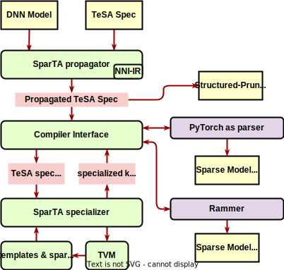

# Overview 

SparTA is a holistic thinking and an end-to-end approach to leverage the sparsity of deep neural network (DNN) models. Given a DNN model and its sparsity specification (*Tensor-with-Sparsity-Attribute*, *TeSA*), SparTA enables the sparsity attributes and patterns (e.g., for pruning and quantization) to be specified, propagated forward and backward across the entire deep learning model, and used to create highly efficient, specialized operators. Please refer our *OSDI '22* paper [SparTA: Deep-Learning Model Sparsity via Tensor-with-Sparsity-Attribute](https://www.usenix.org/conference/osdi22/presentation/zheng-ningxin) for more details.



The resulting SparTA framework can accommodate various sparsity patterns and optimization techniques, delivering 1.7x~8.4x average speedup on inference latency compared to seven state-of-the-art (sparse) solutions with smaller memory footprints. As an end-to-end model sparsity framework, SparTA facilitates sparsity algorithms to explore better sparse models.

## What's TeSA
Pruning mask is one of the most frequently used type of *TeSA*. Below is an example of masked version of `nn.Linear` operation with the binary mask tensor with the same shape of tensor *B*.

```python
import torch
import sparta 
 
M, N, K, sparsity = 1024, 1024, 1024, 0.5
A = torch.Tensor((M,K)).cuda()
# ! TODO complete the example
w_mask = sparta.testing.block_mask(shape=B.shape, block=(32,32), sparsity=sparsity, algo='rand')
dense_op = torch.nn.Linear(K, N)
sparse_op = sparta.nn.SparseLinear(dense_op, weight_tesa=w_mask)
# above is equal to 
# sparse_op = sparta.nn.SparseLinear(dense_op, weight_tesa=sparta.tesa(w_mask))
sparse_op.tune(inputs=(A))
torch.testing.assert_allclose(sparse_op(A), dense_op(A))
```

Besides the pruning indicator, the *TeSA* could contain more information such as quantization formats, dynamic shapes, *etc*.

## SparTA propagator
SparTA leverages the [NNI](https://github.com/microsoft/nni) IR utilities to propagate the *TeSA* across the computational graph. 

After *TeSA* propagation, we could get a compact model through a simple structured pruner. It could be passed to the bottom layers or accessed via the *to-be-determined* API for users.

## Compiler interface
There are lots of compilation works for deep learning. SparTA focuses on sparsity acceleration, and don't want to duplicate the essential compiling functions. It leverages existing deep learning compilers (with essential modification) to implement

1. partition the whole model into sub-graphs after high level graph optimization (e.g., operator fusion).
2. combine individual kernel implementations generated from lower layer to a runnable model 
3. make necessary decisions to select the most suitable kernel implementations from many

### PyTorch
For better support sparse training, `PyTorch` is a necessary compiler, though it has little graph level optimization and mainly works as a operator parser in this scenario. After specializing the sparse kernels, PyTorch could load them as custom operators and generate efficient sparse modules (e.g., [sparse attention]() module).

### Rammer
Rammer ([nnFusion](https://github.com/microsoft/nn-fusion)) is one of the SOTA DNN compilers that is also open sourced by Microsoft. Ideally, Rammer gives the fused sub-graph IR that contains the input/output tesa and format requirements to SparTA via the compiler interface. SparTA perform the transformation and specialization for the sub-graph and return the transformed graph IR and specilizad kernel.

## SparTA specializer
SparTA specializer apply policies on the received subgraph (or fused kernel) and transform it into one or more highly efficient computing kernels. Such computing kernels could be both
- manually optimized computing templates and libraries
- automatically tuned kernels via tools like TVM 

Though there are still some questions still worth answering, such as

1. the boundary between compiler interface and specializer. For example, the granularity of specializer's input is a subgraph (specializer do fusion itself) or a fused kernel specification?
2. how to balance the benefits from the manually optimized kernel implementations and scalable automatic kernel generation.


