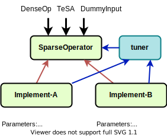

# Code Specializer

SparTA code specializer helps users to generate efficient executable codes for specific operators and their given sparsity TeSA (i.e., pruning mask).

To balance between the flexibility, performance, and developing efficiency, we adopt a *tunable* achitecture for the code specializer (as below). 



## Tunable Implements

The SparseOperator [`sparta.nn.OperatorBase`](reference/nn.rst) incorperates one or more computing kernels, aka., *implement*s. The implements could be hand-crafted efficient kernels (templates or libraries), or codes generated by other tools (e.g., TVM). The operator can select one of the implements according to their performance. And each implement could have tunable parameters, such as Tiling size. The tuner could combine the each implement's search space into a nested search space (like for above)

```python
from sparta.common.tuning import TunableItemCfg
op_search_space = TunableItemCfg('choice', _is_nested=True, _value={
    'implement-A': {
        'A1': TunableItemCfg('choice', _value=[a1,a2,a3]),
        'A2': TunableItemCfg('choice', _value=[a4,a5,a6]),
    },
    'implement-B': {
        'B1': TunableItemCfg('choice', _value=[b1,b2,b3]),
        'B2': TunableItemCfg('choice', _value=[b4,b5,b6]),
    },
})
```

The tuner (based on [NNI](https://github.com/microsoft/nni)) is instance of [sparta.common.tuning.Tunable](reference/tuning.rst)). It could generate samples from the search space based on algorithms such as [Grid Search](https://nni.readthedocs.io/en/stable/reference/hpo.html#nni.algorithms.hpo.gridsearch_tuner.GridSearchTuner), [Random Search](https://nni.readthedocs.io/en/stable/reference/hpo.html#nni.algorithms.hpo.gridsearch_tuner.GridSearchTuner), [TPE](https://nni.readthedocs.io/en/stable/reference/hpo.html#nni.algorithms.hpo.tpe_tuner.TpeTuner), *etc*.

## Binding to PyTorch

We're supporting two kinds of methods to compile implement and load the cooresponding operator to deep learning framework (now only `PyTorch` supported). 

- Torch Cpp Extension
- PyCuda